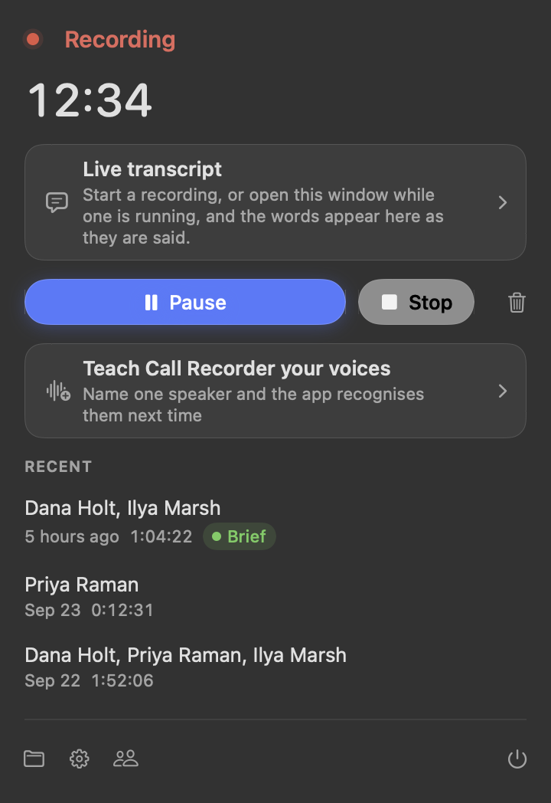
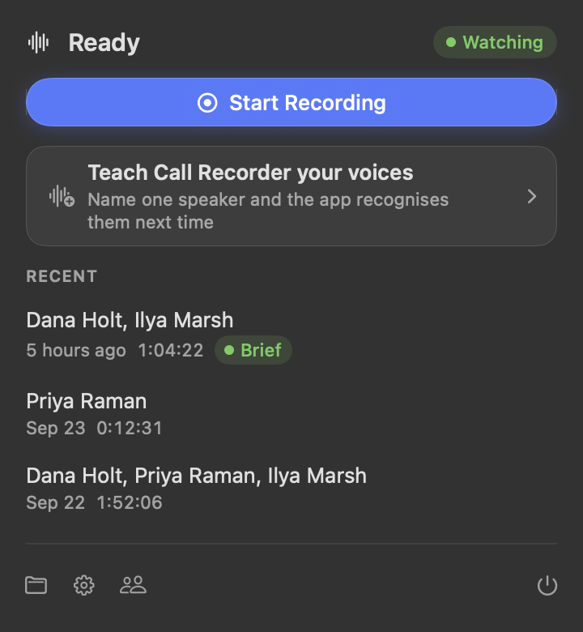
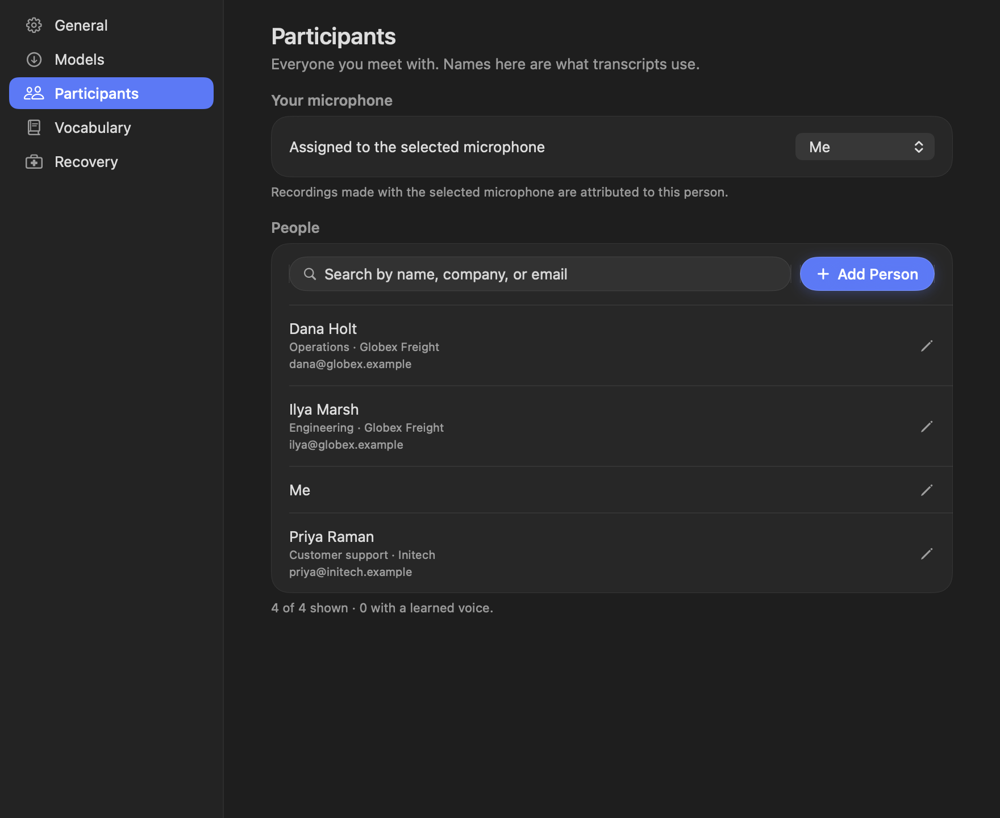
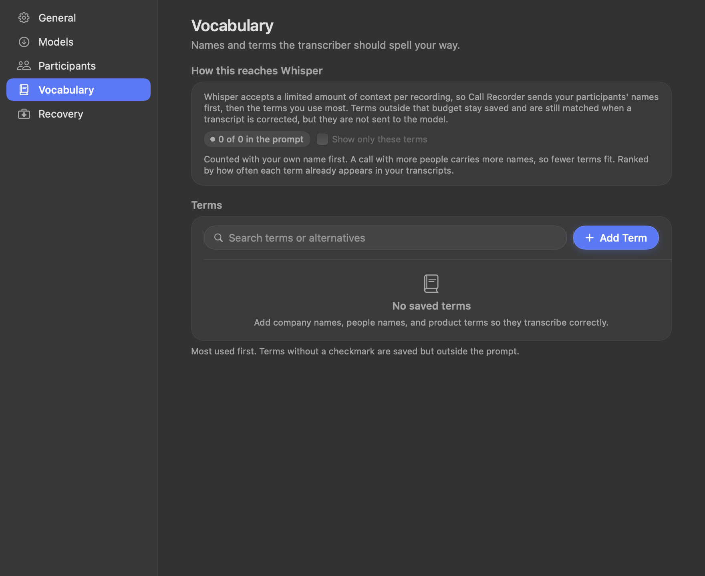
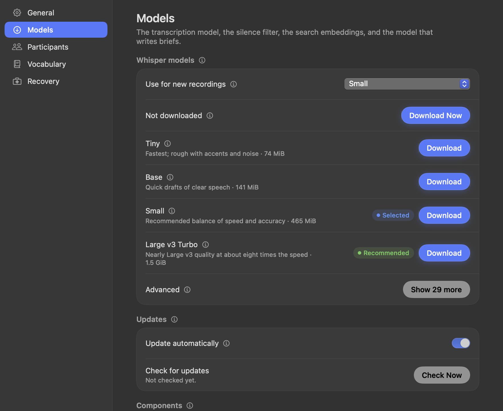
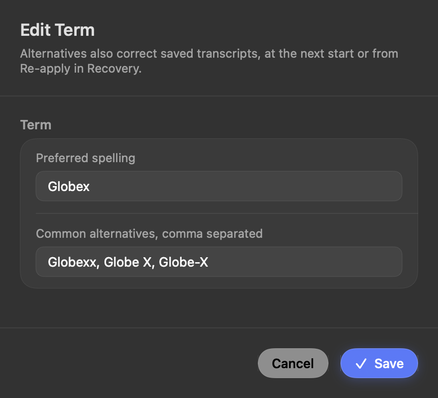

# Call Recorder

A private, local-first call recorder for macOS. Call Recorder records both sides of a call,
transcribes it on your Mac with Whisper, labels who spoke, and keeps every transcript
searchable by keyword and by meaning. Codex can search, read, and curate the library through a
built-in MCP server.

Audio, transcripts, voice profiles, and the search index never leave the machine.



## Features

**Recording**

- Records both sides of a call: the microphone and the system audio.
- Optional automatic start when another app opens the microphone, with automatic stop a couple
  of seconds after the call ends.
- Automatic recording stays inside limits: an app that is not a call never starts one, a
  recording shorter than the floor is set aside, and one that reaches the ceiling is stopped.
  Recording you start and stop by hand is kept whatever it holds.
- A meeting that ends can leave its app holding the microphone. When both sources stay quieter
  than speech for ten minutes, the recording stops.
- Manual Start, Pause, Resume, Stop, and Discard from the menu-bar panel. The next call can
  start while an earlier one is still being processed.
- The microphone is chosen by name, or set to follow whichever input macOS is set to use. A call
  that finishes gives its audio back, unless Settings > General says to keep it.
- One-sided-call detection warns when the other side of the conversation was never captured.

**Updates**

- Call Recorder follows the releases of its own repository, at launch and on a step you choose,
  which is every six hours unless you change it. A newer one is downloaded, checked against the
  digest the release published, and unpacked beside the app, where the bundle inside it is checked
  again before it is trusted.
- The swap happens when the app quits, which is the one moment the bundle is not in use, so no
  recording is ever interrupted by an update. **Restart** in the same card installs a version that
  is already waiting and opens the app again; while a call is being recorded it waits for the call.
- The version that was working is kept in Application Support; **Settings > General > Updates**
  shows the state and can go back to it. Every step is written to
  `~/Library/Logs/CallRecorder/app-update.log`.

**Transcription**

- Whisper runs locally through whisper.cpp, in roughly a hundred languages; the language is
  detected per call, so English and Russian calls need no configuration.
- Output is cleaned for reading: no timestamps, no `[music]`-style annotations, one line per
  spoken turn.
- The same sentence is written once. A chunk seam or a room echo that put the same words into a
  transcript twice is removed, and the copy that stays is the one said first.
- Each call produces a Markdown transcript in the recordings folder, named by date and time.

**Speakers**

- Local diarization through Nemotron 3 separates the recording into voices.
- Optional encrypted voice profiles: confirming a name teaches the voice, and later calls are
  suggested or named automatically. Voiceprints are stored in the macOS Keychain and are never
  part of transcripts, search, diagnostics, or MCP responses.
- Review Speakers shows transcript samples and playable excerpts for each unresolved voice, and
  a run of lines can be moved to a different person when one voice holds two speakers.

**Vocabulary**

- A glossary holds product names, people, and the ways Whisper mishears them. Preferred
  spellings are given to the model before transcription, and the saved text is corrected
  afterwards with the same rules.

**Library and Codex**

- Every finished call is written up as a brief: what it was about, what was agreed, who owes what,
  and what is left open, in the language the call was held in. A local model writes it on this
  Mac; nothing about the call leaves the Mac. The menu-bar row copies it, and the MCP server
  returns it, so a task that needs the call's context reads a hundred and fifty words rather than
  the whole transcript. **Settings > General > "Write a brief"** switches it off, and the model is
  downloaded from **Settings > Models**.
- A call recorded before briefs existed can be written up from its row, without recording it again.
- Every transcript is indexed into a local Turso/libsql database with FTS5 (BM25) ranking and
  256-dimension vector embeddings from a local model that is downloaded once. Search is hybrid
  by default.
- The MCP server ships with the app and exposes 17 tools for calls, transcripts, participants,
  glossary, and speaker review. See [docs/mcp.md](docs/mcp.md).

**Operations**

- Menu-bar app; there is no window to keep open.
- The app updates itself too: a newer release is downloaded and checked in the background, and
  put in place when the app quits or at once when Restart is pressed, so the next launch is the
  new version.
- Models update themselves: the new file is downloaded beside the model in use, verified
  against a published SHA-256, swapped atomically, and the previous copy is kept for revert.
- Recovery tools: database check and backup, restore of working files, retry of failed calls,
  a redacted diagnostics bundle, and Copy Error Details on every failure surface.
- Audio is moved to a 24-hour "Recently Deleted" area only after the transcript and the search
  index are verified. Nothing is deleted silently.

## Screenshots

| | |
| --- | --- |
|  |  |
|  |  |
|  |  |

## Requirements

- Apple silicon Mac running macOS 15 (Sequoia) or newer.
- [Homebrew](https://brew.sh) packages: `ffmpeg` (capture and conversion) and `whisper-cpp`
  (transcription).
- Optional, for speaker labels: a local Python environment with `pyannote.audio`, `librosa` and
  transformers 5.18.
- Optional, for briefs: `llama.cpp` (the runtime that loads the brief model) and the model
  itself from **Settings > Models**.

## Install

### From a release

1. Download `CallRecorder-0.1.27.zip` from the
   [latest release](https://github.com/Rawgeek/call-recorder/releases/latest) and unzip it.
2. Move `Call Recorder.app` to `/Applications`.
3. First launch only: right-click the app and choose **Open**. The build is signed locally, not
   notarized by Apple, so a double-click shows a warning. After the first open, a normal
   double-click works.
4. Approve the macOS prompts: **Microphone** and **Screen & System Audio Recording**. The
   second permission is what records the other side of the call.
5. Open the menu-bar icon and choose **Settings**:
   - **Models**: download a Whisper model. `medium` is a good default; larger models are more
     accurate and slower. The silence filter, about 865 KB, downloads on its own. Everything
     runs locally.
   - **General**: choose the microphone or follow the system's own choice, the recordings folder
     (default `~/Desktop/Call Recordings`), whether recording starts when another app opens the
     microphone, whether a Mac with no audio input records the other side alone, whether the people
     on a call decide how many voices are separated, and whether a finished call keeps its audio.
   - **Participants**: add the people you meet with, and mark which one is you.
6. Leave **Start at login** on if you want it always available.

From 0.1.4 on, later versions install themselves: the check runs in the background, and the new
version is put in place when the app quits or when Restart is pressed, so there is no download and
no reinstall to do by hand.

A version that Settings calls ready is installed the next time the app is reopened. Nothing moves
while it runs. **Settings -> Updates -> Restart** closes the app and reopens the new version.

### From source

```sh
brew install ffmpeg whisper-cpp bun
git clone https://github.com/Rawgeek/call-recorder.git
cd call-recorder
swift build -c release
```

Run it directly with `swift run CallRecorder`, or build a distributable bundle:

```sh
scripts/package-app.sh "dist/Call Recorder 0.1.4"
```

Packaging needs `bun` on `PATH` (or `CALL_RECORDER_BUN`). With no identity named the bundle is
signed ad-hoc, which needs no certificate, no keychain, and no password: that build runs on this
machine. Name the certificate the releases use,
`CALL_RECORDER_SIGNING_IDENTITY="Call Recorder Local Development"`, for a build that ships, or that
replaces an installed app without macOS asking for the microphone and screen-recording permissions
again. `CALL_RECORDER_SKIP_SIGNING=1` leaves the bundle unsigned, which is only for measuring a
build.

The JavaScript runtime, `bun` and the search dependencies, travels as one compressed archive of
about 36 MB. It is not inside the app: the app is 10 MB, and the archive is fetched once from the
release page, unpacked into Application Support, and kept there, so a Mac that has it can rebuild
the runtime without the network. The path Codex registers does not change, and Codex can fetch the
archive itself when it starts the MCP server with no app running.

Set `CALL_RECORDER_EMBED_RUNTIME=1` to package a self-contained app instead: the archive travels
inside the bundle, nothing is fetched, and that build needs no network.

### Speaker identification (optional)

Whisper transcribes speech; it does not know who is speaking. Nemotron 3 Diarization says who
spoke when, the pyannote.audio community-1 embedder turns each of those voices into the profile a
name is matched against, and the app learns that profile when you confirm a name. All of it runs
on the Mac.

1. Accept the licence for `pyannote/speaker-diarization-community-1` on Hugging Face, and sign
   in once so a token is stored locally (`hf auth login`). Nemotron 3 Diarization is not gated
   and needs no licence.
2. Create a Python environment:

   ```sh
   python3 -m venv ~/pyannote-env
   ~/pyannote-env/bin/pip install pyannote.audio torch torchaudio librosa
   ~/pyannote-env/bin/pip install \
       "transformers @ git+https://github.com/huggingface/transformers@f324707307757d9c0b8dac1c4462eceff911fa2f"
   ```

   The turn model is read by transformers 5.18, which is not on PyPI yet, so the revision above is
   pinned. Both models are downloaded once, on first use, into the Hugging Face cache.

3. In the app: open **Review Speakers** (from the menu-bar panel, or **Settings -> Recovery ->
   Review Speakers...**), then **Speaker setup -> Choose Python Environment**, and select
   `~/pyannote-env/bin/python3`. Press **Check Speaker Setup**; the panel should report that
   the local speaker model is ready.

If a call comes out with one person as two voices, or two people as one, Review Speakers shows how
many voices the call was separated into, and separates it again with the number you count. A
number you count is answered by the count-aware pyannote.audio separator, which is slower than the
separation a call is recorded with; **Settings -> General -> Separate voices by the people on the
call** asks that same separator for the number of people on the call.

Without this step the app still transcribes everything, with speakers shown as Speaker 1,
Speaker 2, and so on.

## Connect Codex (MCP)

The app ships an MCP server so Codex can search transcripts, read calls, manage participants
and vocabulary, and review speakers:

```sh
codex mcp add call-recorder -- "/Applications/Call Recorder.app/Contents/Resources/indexer/bun" "/Applications/Call Recorder.app/Contents/Resources/indexer/mcp-server.js"
codex mcp list
```

Restart Codex after adding the server so it loads the tools. The full tool list, the write
model, and example prompts are in [docs/mcp.md](docs/mcp.md).

## Where your files live

| Path | Contents |
| --- | --- |
| `~/Desktop/Call Recordings` | Transcripts (`<date-time>.md`) and a small metadata file per call. The folder is configurable. |
| `~/Library/Application Support/CallRecorder/calls.db` | The local library: calls, participants, glossary, transcripts, search index. |
| `~/Library/Application Support/CallRecorder/models` | Downloaded Whisper, VAD, and embedding models. |
| `~/Library/Application Support/CallRecorder/runtime` | The JavaScript runtime the search index and the MCP server run on, unpacked from the app once per version. |
| `~/Library/Application Support/CallRecorder/Recently Deleted` | Working folders kept for 24 hours after a call is finished or discarded. |
| `~/Library/Application Support/CallRecorder/Speaker Samples` | Short clips cut for speaker review, with the silence removed. Kept for a fortnight. |
| `~/Library/Application Support/CallRecorder/voiceprints` | The voice-profile key a development run uses, so that no keychain dialog appears. The installed app keeps this key in the Keychain. |
| macOS Keychain | The encryption key for voice profiles. |

## Privacy

- Recording, transcription, diarization, embedding, and search all run locally.
- No account, no telemetry, and no network call other than model downloads from the model host
  you configure.
- Voice profiles are encrypted with a key in the macOS Keychain, and are excluded from
  transcripts, diagnostics, and MCP responses.
- The MCP server exposes read tools for everything, and write tools only for vocabulary,
  participant records, and queued speaker requests. It cannot start, stop, or delete a
  recording or transcript.

## How it works

```
microphone --------\
                    >-- capture -- finalize (ffmpeg) --+-- whisper.cpp -- clean -- glossary fix
system audio ------ /                                  |                      |
                                                       |                      v
                                                       |            transcript + metadata
                                                       v                      |
                                              VAD / Silero (speech)           |
                                                       |                      v
                                                       v            Turso/libsql (chunks,
                                              Nemotron 3 diarization  FTS5 + vector index)
                                                       |                      |
                                                       v                      v
                                              speaker review  <----  MCP server for Codex
```

- **Capture**: microphone and system audio are recorded as separate sources, then mixed into
  one `call.m4a` during finalization.
- **Silence**: Silero VAD marks speech regions so silence never reaches Whisper.
- **Diarization**: Nemotron 3 splits speech into voices and the pyannote.audio embedder measures
  each of them; unmatched voices wait in Review Speakers.
- **Indexing**: the transcript is split into chunks; each chunk gets an embedding from the
  bundled local model and a row in the FTS5 index. Search ranks with BM25, vectors, or both.
- **Brief**: the finished transcript is read once by a local model, which writes the short version
  of the call. A call too long for one pass is read in parts, and the parts are joined into one
  brief. The model is started for that call and stopped when the brief is saved.
- **Cleanup**: once the transcript and the index are verified and speaker review is settled,
  the working folder moves to Recently Deleted for 24 hours and is then purged.

## Development

```sh
swift build          # debug build
swift test           # 648 Swift tests
cd mcp && bun install && bun test    # 56 MCP tests, plus: bun run typecheck
```

A development run keeps its voice-profile key in a file instead of the keychain. Voice profiles are
sealed with a key that lives in a keychain item, and the keychain decides whether a program may read
one by the program's signature: a rebuild is a new program to it, so every start from the build
directory used to meet a password dialog with nothing on screen to explain it. The file is
`~/Library/Application Support/CallRecorder/voiceprints/embedding-key-v1`, which only this account
can read. It holds the key the installed app keeps in the keychain, because both programs read one
library: the first development run that finds profiles already sealed copies it out of the keychain,
which is the one time it asks, and every run after that reads the file. Set
`CALL_RECORDER_VOICEPRINT_KEY=keychain` for a run that should use the keychain throughout. The
installed app, which macOS recognises by the identity it was signed with, goes on using it.

Render every window to PNGs without packaging, signing, or installing:

```sh
scripts/preview.sh /tmp/call-recorder-preview
```

The renderer reads the real library by default, so review pictures show real data. To render
against a throwaway library instead, set `CALL_RECORDER_PREVIEW_HOME` to an empty directory.

The repository layout:

| Path | Contents |
| --- | --- |
| `Sources/CallRecorderApp` | Menu bar, capture, processing, settings, and review surfaces. |
| `Sources/CallRecorderCore` | Database, reducer, matchers, glossary correction, transcription boundaries. |
| `mcp/` | The MCP server and the transcript indexer (TypeScript, run by bun). |
| `scripts/` | Packaging, preview rendering, layout measurement, and glossary tooling. |
| `docs/` | Install guide, MCP guide, design contract, pitfalls, and screenshots. |

## Troubleshooting

See [INSTALL.md](INSTALL.md#10-troubleshooting) for the common failures: missing ffmpeg, no
system audio, a stuck transcription, an unavailable speaker environment, and database
recovery. Every error surface in the app also offers **Copy Error Details**, which is the most
useful thing to include in an issue. The [wiki](https://github.com/Rawgeek/call-recorder/wiki)
carries the same material in shorter form, with the install and MCP steps.

## Contributing

Issues and pull requests are welcome. Read [CONTRIBUTING.md](CONTRIBUTING.md) first; it
describes the build, the test suites, and the checks a change is expected to pass.

## License

MIT. See [LICENSE](LICENSE).
